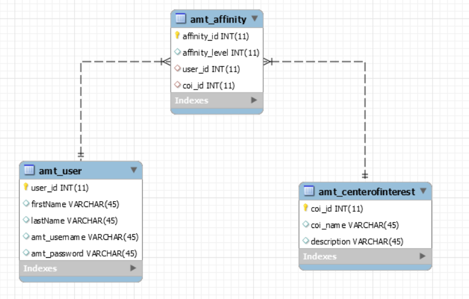

# Goal
This project aims to create associations between some users and some centers of interest. What we mean by center of interest is a general concept: it could be a topic, an idea, an activity, an artist, a political view, a belief system, etc... (we could even extend its scope)
A user will be able to:
- Create an account.
- Create some centers of interest.
- Add an affinity between himself and a center of interest.
- Merge centers of interest (to avoid duplication).
- Browse centers of interest pages, users and affinities (when he has the authorization).



## Automation

to start the payara server with the docker topology, just run the bash script on the project root. Access the main page at
```text
192.168.99.100/AffinitiesNetwork-1.0-SNAPSHOT/index
```
